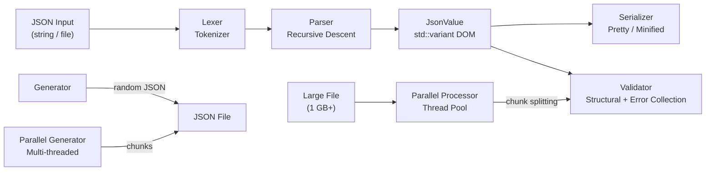

<p align="center">
  <h1 align="center">cpp-json-parser</h1>
  <p align="center">High-performance JSON parser, validator, and generator built with C++17</p>
</p>

<p align="center">
  
  
  
  
  
</p>

---

A complete JSON toolkit featuring a hand-written recursive-descent parser, serializer, schema validator, multi-threaded parallel processing engine, and large-file generator. Uses `std::variant` for type-safe value representation and chunk-based parallel validation for files exceeding 1 GB.

## Architecture



## Features

- **Recursive-descent parser** with detailed error reporting (line and column numbers)
- **Type-safe JSON DOM** using `std::variant<nullptr_t, bool, double, string, vector, map>`
- **JSONPath-style access** -- `value.findByPath("user.address.city")` and `items[0].name`
- **Serializer** with pretty-print (configurable indent) and minified output
- **Tolerant parsing** -- continues after errors, collecting all issues in one pass
- **Structural validator** with customizable rules and detailed error collection
- **Parallel processor** -- splits large JSON arrays into chunks and validates across multiple threads
- **Parallel generator** -- generates arbitrarily large JSON files (up to 10 GB) using a thread pool
- **Streaming mode** for 1 GB+ files -- validates with ~50 MB memory footprint
- **Progress callbacks** for long-running operations with built-in terminal progress bar
- **System info detection** for automatic thread count optimization

## Performance

| Operation | Size | Time | Memory |
|-----------|------|------|--------|
| File generation | 100 MB | ~10 sec | ~50 MB |
| File generation | 1 GB | ~5 min | ~50 MB |
| Full loading | 100 MB | ~5 sec | ~200 MB |
| Streaming validation | 1 GB | ~40 sec | ~50 MB |
| Tolerant loading | 1 GB | ~120 sec | ~2 GB |

## Tech Stack

| Component | Technology |
|-----------|-----------|
| Language | C++17 (GCC 7+, Clang 5+, MSVC 2017+) |
| Build System | CMake 3.10+ |
| JSON DOM | `std::variant` / `std::map` / `std::vector` |
| Concurrency | `std::thread` / `std::mutex` / `std::atomic` / `std::future` |
| Platform | Cross-platform (Linux, macOS, Windows) |

## Project Structure

```
cpp-json-parser/
├── include/
│   ├── JsonValue.hpp           # Core JSON value type (variant-based)
│   ├── Lexer.hpp               # Token types and lexer interface
│   ├── Parser.hpp              # Recursive-descent parser
│   ├── Serializer.hpp          # JSON pretty-printer / minifier
│   ├── Validator.hpp           # Structural validation with error collection
│   ├── Generator.hpp           # Random JSON file generator
│   ├── ParallelProcessor.hpp   # Multi-threaded validation and generation
│   ├── SystemInfo.hpp          # CPU / memory runtime detection
│   └── ProgressBar.hpp         # Terminal progress bar
├── src/                        # Implementation files
│   ├── Lexer.cpp               # Tokenizer (strings, numbers, keywords)
│   ├── Parser.cpp              # Recursive descent parsing logic
│   ├── JsonValue.cpp           # Value accessors, path lookup
│   ├── Serializer.cpp          # Indented JSON output
│   ├── Generator.cpp           # Configurable random JSON generation
│   ├── Validator.cpp           # Tolerant validation with error collection
│   ├── ParallelProcessor.cpp   # Thread pool for parallel validation
│   └── main.cpp                # CLI entry point and menu system
└── CMakeLists.txt
```

## Quick Start

### Build

```bash
git clone https://github.com/damn8daniel/cpp-json-parser.git
cd cpp-json-parser
mkdir build && cd build
cmake .. -DCMAKE_BUILD_TYPE=Release
cmake --build . -j$(nproc)
```

### Run

```bash
./jsonparser
```

The interactive CLI provides a menu-driven interface:

| Menu Item | Description |
|-----------|-------------|
| [1] | Load a JSON file |
| [2] | Display structure (tree view) |
| [3] | Search by path (e.g., `user.address.city`) |
| [4] | Edit a value |
| [5] | Add an element |
| [6] | Delete an element |
| [7] | Save to file |
| [8] | Validate JSON |
| [9] | Statistics |
| [10] | Execution metrics |
| [11] | Generate JSON file (up to 100 MB) |
| [12] | Validate with error counting |
| [13] | System information |
| [14] | Multithreaded validation |
| [15] | Generate large files (1--10 GB) |

### Usage Example (API)

```cpp
#include "Parser.hpp"
#include "Serializer.hpp"

// Parse from string
auto value = json::Parser::parseString(R"({"name": "Alice", "age": 30})");

// Access values
std::string name = value["name"].asString();  // "Alice"
double age = value["age"].asNumber();          // 30.0

// JSONPath access
auto city = value.findByPath("address.city");

// Serialize with pretty-print
json::Serializer serializer;
std::string pretty = serializer.serialize(value, true, 2);

// Parse large file with progress callback
auto data = json::Parser::parseFileWithProgress("large.json",
    [](size_t current, size_t total) {
        std::cout << (100 * current / total) << "%" << std::endl;
    });
```

### Large File Handling

When loading a file larger than 500 MB, the parser offers a choice:

- **Streaming validation** -- validates without loading the entire file (~50 MB RAM, ~40 sec for 2 GB)
- **Tolerant loading** -- skips errors and loads all valid elements into memory

## Requirements

- **Compiler:** C++17 support (GCC 7+, Clang 5+, MSVC 2017+)
- **CMake:** 3.10+
- **RAM:** 4 GB minimum (8+ GB recommended for large file processing)

## License

MIT
